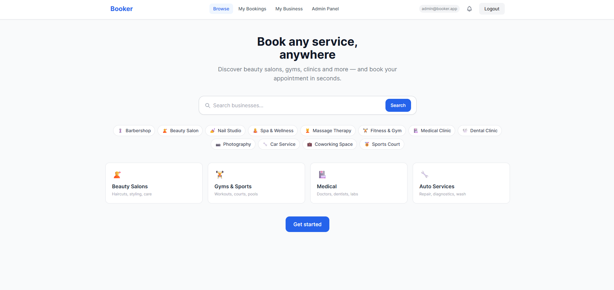
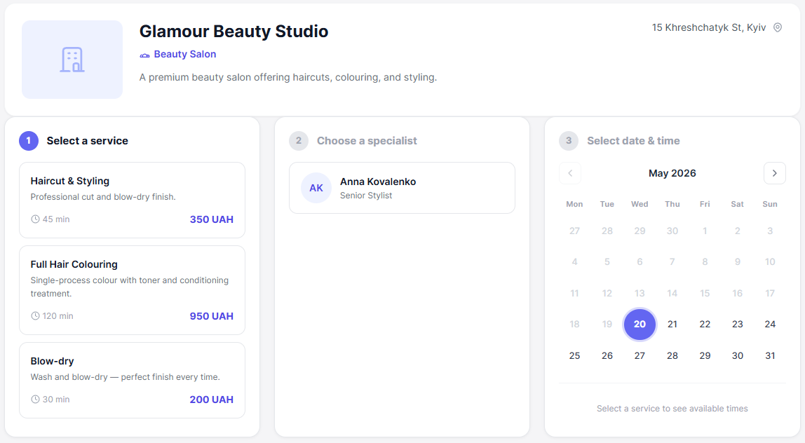
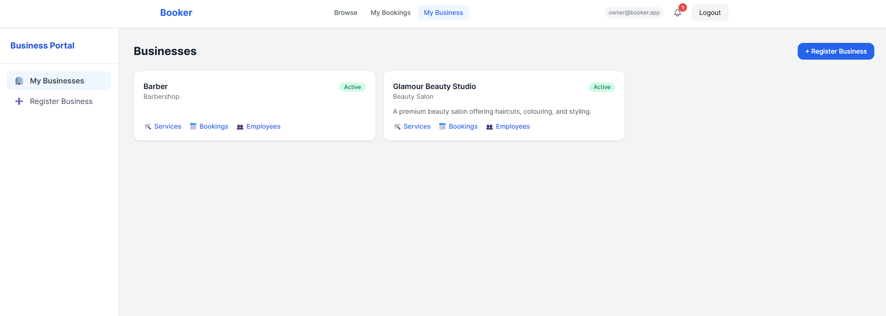
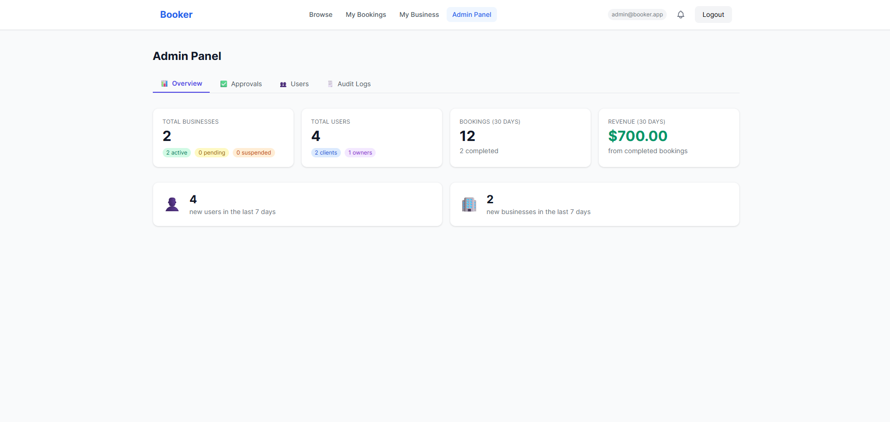

<div align="center">

# Booker

**A production-quality, multi-tenant SaaS marketplace for service-based businesses.**

Book a haircut, a tennis court, a medical appointment, or a car wash — all through one platform.

[](https://github.com/your-org/booker/actions)
[](https://github.com/your-org/booker)
[](https://openjdk.org/projects/jdk/21/)
[](https://spring.io/projects/spring-boot)
[](https://angular.dev)
[](https://www.postgresql.org/)
[](LICENSE)

[Features](#-features) · [Architecture](#️-architecture) · [Quick Start](#-quick-start) · [API Docs](#-api-documentation) · [Roadmap](#️-roadmap)

</div>

---

## What Is Booker?

Booker is an end-to-end **appointment and resource booking platform** that aggregates diverse service businesses under a single, unified interface. Business owners onboard their staff, define services, and manage schedules — clients discover businesses, filter by location, and book available slots in real time.

The platform is engineered as a **modular monolith** with clean module boundaries, designed for straightforward extraction into microservices when traffic demands it.

### User Roles

| Role | Capabilities |
|---|---|
| **Client** | Discover businesses by location/category, view slots, book appointments, manage bookings |
| **Employee** | View personal schedule, confirm bookings, manage availability |
| **Business Owner** | Onboard and manage branches, staff, services, schedules; view analytics |
| **Admin** | Moderate platform, approve businesses, manage users, access platform-wide analytics |

---

## 📸 Screenshots

> _Screenshots coming soon. Run the app locally with `docker compose up` to see it in action._

| Search | Booking Flow | Business Dashboard | Admin Panel |
|---|---|---|---|
|  |  |  |  |

---

## ✨ Features

### Core Booking Engine
- **Conflict-safe booking** — PostgreSQL advisory locks + `EXCLUDE USING GIST` constraint guarantee exactly one winner per slot, even under concurrent load
- **15-minute slot grid** — configurable slot generation from schedule rules, with break exclusions and day-off overrides
- **Snapshot integrity** — price and duration are snapshotted at booking time; historical records stay accurate if services change
- **Booking lifecycle** — `PENDING → CONFIRMED → COMPLETED` / `CANCELLED` / `NO_SHOW` state machine enforced in the domain layer

### Multi-Tenant Architecture
- Shared database with application-level tenant isolation (`business_id` on every tenant row)
- No cross-tenant data leakage — enforced in every repository query and `@PreAuthorize` expression
- Ready-to-add PostgreSQL Row-Level Security for future microservice extraction

### Dynamic Service Catalog
- **Zero-code business type extension** — new categories and their attributes are defined through the admin API, no deployments required
- JSONB attribute storage with schema-driven validation: TEXT, NUMBER, BOOLEAN, SELECT, MULTI_SELECT
- Cached attribute definitions per category (`@Cacheable`) — no repeated DB round-trips during service creation

### Search & Discovery
- **Geo-proximity search** via PostGIS `ST_DWithin` — find businesses within a configurable radius
- **Full-text search** via PostgreSQL `tsvector` — ranked results by relevance
- Combined geo + text + category filtering in a single query

### Real-Time Notifications
- WebSocket (STOMP) push for booking events
- In-app notification centre with read/unread state
- Email notifications via `EmailService` interface — swappable from mock (dev) to SendGrid/SES (prod) without caller changes
- Event-driven architecture: all notification dispatch is decoupled via Spring `ApplicationEvent`

### Analytics
- Business owner dashboard: bookings per day, revenue by service, employee utilization, cancellation rate
- Platform admin overview: active businesses, user counts by role, platform-wide bookings and revenue trends

### Security
- **JWT authentication** — access + refresh token pair; refresh tokens stored as SHA-256 hashes (never raw)
- **BCrypt password hashing** at strength 12
- **RBAC via Spring Security** — method-level `@PreAuthorize` throughout every controller
- **Audit log** — all auth events (login, logout, failed attempts, password resets) recorded asynchronously
- CORS locked to configured origins — no wildcards in production

---

## 🏗️ Architecture

Booker is a **Modular Monolith**: a single deployable JAR with strictly enforced module boundaries. Modules communicate only through Spring `ApplicationEvent`s or shared DTOs — never via direct cross-module repository calls.

```
┌──────────────────────────────────────────────────────────────────┐
│                         CLIENTS                                  │
│   Angular 17 SPA        Mobile App (planned)    External API     │
└────────────┬─────────────────────┬────────────────────┬─────────┘
             │ HTTPS / REST        │                    │
             ▼                     ▼                    ▼
┌──────────────────────────────────────────────────────────────────┐
│                    NGINX (API Gateway)                           │
│            Rate limiting · TLS termination · Routing             │
└───────────────────────────┬──────────────────────────────────────┘
                            │
┌───────────────────────────▼──────────────────────────────────────┐
│              SPRING BOOT 3.3 — MODULAR MONOLITH                  │
│                                                                  │
│  ┌─────────┐  ┌──────────┐  ┌─────────┐  ┌─────────┐  ┌──────┐ │
│  │  auth   │  │ business │  │ catalog │  │ booking │  │search│ │
│  └─────────┘  └──────────┘  └─────────┘  └─────────┘  └──────┘ │
│  ┌──────────────┐  ┌────────────┐  ┌───────────────┐            │
│  │ notification │  │ analytics  │  │    shared     │            │
│  └──────────────┘  └────────────┘  └───────────────┘            │
│                                                                  │
│          Cross-module communication: ApplicationEvents only      │
└──────────┬───────────────────────────────────┬───────────────────┘
           │                                   │
           ▼                                   ▼
  ┌──────────────────┐                ┌──────────────────┐
  │  PostgreSQL 16   │                │    Redis 7       │
  │  PostGIS 3.4     │                │  Cache · Locks   │
  └──────────────────┘                └──────────────────┘
```

See [`features/ARCHITECTURE.md`](features/ARCHITECTURE.md) for the full architectural spec, database schema, and module contract rules.

---

## 🛠️ Tech Stack

### Backend

| Layer | Technology | Why |
|---|---|---|
| Language | Java 21 (LTS) | Virtual threads, record types, pattern matching |
| Framework | Spring Boot 3.3 | Production-proven, rich ecosystem |
| Security | Spring Security 6 + custom JWT | Fine-grained RBAC, stateless sessions |
| ORM | Spring Data JPA + Hibernate 6 | JPQL + native JSONB queries |
| Database | PostgreSQL 16 + PostGIS 3.4 | Geo-queries, EXCLUDE constraints, JSONB |
| Migrations | Flyway | Versioned, repeatable, safe |
| Cache | Spring Cache (simple → Redis) | `attributeDefs`, `businessCategories` caches |
| Async | Spring `@Async` + `@Scheduled` | Event dispatch, booking reminders |
| WebSocket | Spring WebSocket + STOMP | Real-time notification push |
| API Docs | SpringDoc OpenAPI 3 | Auto-generated Swagger UI |
| Build | Maven 3.9 | Dependency management, multi-stage Docker |

### Frontend

| Layer | Technology | Why |
|---|---|---|
| Framework | Angular 17 (NgModule) | Strong typing, DI, mature component model |
| State | NgRx (Signals-based) | Predictable state, devtools, effects pipeline |
| UI | Angular Material + TailwindCSS | Component library + utility-first styling |
| Real-time | `@stomp/ng2-stompjs` | WebSocket / STOMP subscription |
| HTTP | `HttpClient` + interceptors | Centralized JWT injection, error handling |
| Build | Angular CLI + esbuild | Fast builds, tree shaking, code splitting |

### Infrastructure

| Component | Technology |
|---|---|
| Containerization | Docker + Docker Compose |
| Orchestration | Kubernetes-ready (single-service Helm chart planned) |
| CI/CD | GitHub Actions |
| File storage | AWS S3 / MinIO (planned) |
| Email | MockEmailService (dev) → SendGrid / SES (prod) |

---

## 🚀 Quick Start

### Prerequisites

- **Docker** 24+ and **Docker Compose** v2
- **Java 21** (for local backend development)
- **Node.js 20+** and **npm** (for local frontend development)

### Option A — Full Stack with Docker (recommended)

```bash
# 1. Clone the repository
git clone https://github.com/your-org/booker.git
cd booker

# 2. Create your environment file (copy the template and fill in JWT_SECRET at minimum)
cp .env.example .env

# 3. Start all services
docker compose up --build
```

| Service | URL |
|---|---|
| Angular SPA | http://localhost:4200 |
| Spring Boot API | http://localhost:8080/api |
| Swagger UI | http://localhost:8080/api/swagger-ui.html |
| PostgreSQL | localhost:5432 |
| Redis | localhost:6379 |

### Option B — Backend Only (local dev)

```bash
# Start infrastructure
docker compose up postgres redis -d

# Run the backend
cd booker-backend
mvn spring-boot:run
```

### Option C — Frontend Only

```bash
cd booker-frontend
npm install
npm start          # http://localhost:4200
```

> The dev frontend proxies `/api` to `http://localhost:8080` by default.

---

## ⚙️ Environment Variables

Copy `.env.example` to `.env` and configure:

| Variable | Required | Default | Description |
|---|---|---|---|
| `JWT_SECRET` | **Yes** | — | Base64-encoded 256-bit secret for JWT signing |
| `FRONTEND_URL` | No | `http://localhost:4200` | CORS allowed origin + password-reset link base |
| `MAIL_HOST` | No | `smtp.sendgrid.net` | SMTP server hostname |
| `MAIL_PORT` | No | `587` | SMTP port |
| `MAIL_USER` | No | `apikey` | SMTP username |
| `MAIL_PASS` | No | — | SMTP password / API key |
| `MAIL_FROM` | No | `noreply@booker.app` | Sender address |

> **Mail is mocked by default.** The app starts without any SMTP configuration and logs outgoing emails to the console. To send real emails, set all `MAIL_*` variables. See [`features/email-notifications.md`](features/email-notifications.md).

---

## 📁 Project Structure

```
booker/
├── booker-backend/              # Spring Boot 3 — Modular Monolith
│   ├── src/main/java/com/booker/
│   │   ├── auth/                # JWT, RBAC, audit log, user management
│   │   ├── business/            # Businesses, branches, employees, resources
│   │   ├── catalog/             # Services, dynamic attribute system
│   │   ├── booking/             # Slot generation, booking engine, schedules
│   │   ├── search/              # Geo + full-text search (PostGIS)
│   │   ├── notification/        # In-app, email, WebSocket notifications
│   │   ├── analytics/           # Business and platform analytics
│   │   └── shared/              # Exception handling, DTOs, security config
│   ├── src/main/resources/
│   │   ├── application.yml      # Application configuration
│   │   └── db/migration/        # Flyway migrations (V1–V5)
│   └── src/test/                # Unit tests (Mockito) + Integration tests (Testcontainers)
│
├── booker-frontend/             # Angular 17 SPA
│   └── src/app/
│       ├── core/                # Services, guards, interceptors
│       ├── features/            # Lazy-loaded feature modules
│       ├── shared/              # Shared components, pipes, directives
│       └── store/               # NgRx state (auth, booking, business, admin)
│
├── features/                    # Architecture specs and feature documentation
│   ├── ARCHITECTURE.md          # Full architectural spec and decisions
│   ├── ROADMAP.md               # Planned features (Phase 7+)
│   └── phase-*.md               # Per-phase implementation specs
│
├── docker-compose.yml           # postgres + redis + app services
├── .env.example                 # Environment variable template
└── README.md                    # You are here
```

---

## 🧪 Testing

### Unit Tests (Mockito — no Spring context, no Docker)

```bash
cd booker-backend
mvn test -Dtest="*UnitTest"
```

Covers: `SlotGeneratorService`, `ServiceAttributeValidator`, `BookingService` (status transitions), `AuthService` (register / login / refresh / logout).

### Integration Tests (Testcontainers — real PostgreSQL)

```bash
# Requires Docker to be running
mvn test -Dtest="*IntegrationTest"
```

Covers: full booking lifecycle, concurrent booking race condition (5 threads, 1 slot), auth flows (register → login → refresh → logout), schedule rules.

### Frontend Unit Tests

```bash
cd booker-frontend
npm test
```

### Run All Tests

```bash
# From root — backend only
cd booker-backend && mvn verify
```

---

## 📖 API Documentation

With the backend running, Swagger UI is available at:

**[http://localhost:8080/api/swagger-ui.html](http://localhost:8080/api/swagger-ui.html)**

### Key Endpoint Groups

| Tag | Base Path | Description |
|---|---|---|
| Auth | `/auth` | Register, login, refresh, logout, password reset |
| Search | `/search` | Geo + text business discovery |
| Businesses | `/businesses` | Business and branch management |
| Catalog | `/businesses/{id}/services` | Service management |
| Booking | `/bookings`, `/slots` | Slot availability and booking CRUD |
| Notifications | `/notifications` | In-app notification management |
| Analytics | `/analytics` | Business and platform analytics |
| Admin | `/admin` | User/business moderation (ADMIN role) |

All endpoints returning collections use the unified `PagedResponse<T>` wrapper:

```json
{
  "content": [...],
  "totalElements": 42,
  "totalPages": 3,
  "number": 0,
  "size": 20
}
```

---

## 🗺️ Roadmap

| Phase | Status | Description |
|---|---|---|
| Phase 1 — Auth & RBAC | ✅ Complete | JWT, refresh tokens, audit log, RBAC |
| Phase 2 — Business Catalog | ✅ Complete | Businesses, branches, dynamic service attributes |
| Phase 3 — Booking Engine | ✅ Complete | Slot generation, conflict-safe booking, schedules |
| Phase 4 — Search & Notifications | ✅ Complete | Geo-search, email, WebSocket, in-app notifications |
| Phase 5 — Analytics & Admin | ✅ Complete | Dashboards, admin panel, audit log viewer |
| Phase 6 — Hardening & Testing | ✅ Complete | Unit tests, race condition tests, Docker, security audit |
| Phase 7 — Payments | 🔜 Planned | Stripe integration, deposit/prepay flows, refunds |
| Phase 8 — Reviews & Ratings | 🔜 Planned | Post-booking reviews, business rating aggregation |
| Phase 9 — Mobile App | 🔜 Planned | React Native / Flutter client |
| Phase 10 — Public API | 🔜 Planned | Webhook subscriptions, third-party integrations |

See [`features/ROADMAP.md`](features/ROADMAP.md) for detailed specifications of upcoming phases.

---

## 🤝 Contributing

Contributions are welcome. Please follow the workflow below:

1. **Fork** the repository and create a feature branch: `git checkout -b feat/your-feature`
2. Write code that passes all existing tests: `mvn verify`
3. Add tests for any new behaviour (unit tests for pure logic, integration tests for endpoints)
4. Open a **Pull Request** with a clear description of the change and its motivation
5. Request a review — all PRs require at least one approval before merge

### Coding Standards

**Backend**
- Follow standard Java naming conventions (camelCase fields, PascalCase classes)
- Use `record` types for DTOs and value objects
- Use `@RequiredArgsConstructor` + final fields (no field injection)
- Every controller endpoint must have `@Operation(summary = "...")` and an appropriate `@PreAuthorize`
- Module boundary rule: **no direct cross-module repository calls** — use application events
- All user-facing error messages go through `BookerException` factory methods (`notFound`, `conflict`, `forbidden`, `badRequest`)

**Frontend**
- Feature state lives in NgRx; components must not hold business logic
- One feature module per route group; all routes must use `loadChildren`
- Shared components/pipes go in `SharedModule` — never in feature modules
- Services are injectable at `{ providedIn: 'root' }` unless scoped intentionally

**General**
- Keep comments and documentation in English
- Do not commit secrets or credentials
- Do not merge migrations that break the `validate` DDL mode

---

## 📄 License

This project is licensed under the **MIT License** — see the [LICENSE](LICENSE) file for details.

---

<div align="center">
Built with ☕ and Spring Boot · Feedback and PRs welcome
</div>
